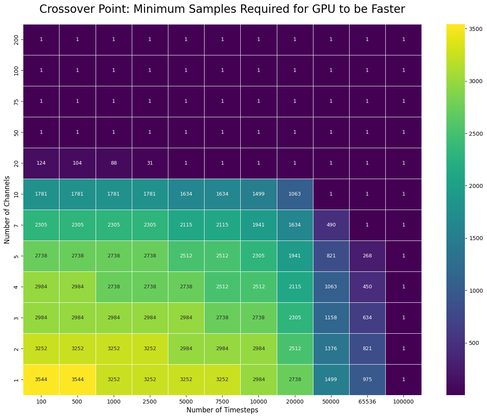

# 🚀 PyTorch ROCKET (gpu_rocket)

A high-performance, GPU-accelerated PyTorch implementation of the **ROCKET** (RandOm Convolutional Kernel Transform) algorithm for multivariate Time Series Classification (TSC) and Regression.

Standard ROCKET relies on a non-trainable ensemble of 10,000 random kernels. While training the final linear classifier is extremely fast, the standard CPU-based feature extraction can become a bottleneck during inference—especially for high-frequency, multi-channel data in demanding real-time environments (e.g., manufacturing). 

This repository solves that bottleneck by porting the transformation pipeline to PyTorch, taking full advantage of GPU parallelization. Furthermore, it introduces **`softPPV`**, a novel differentiable pooling function that enables end-to-end backpropagation and fine-tuning of the ROCKET kernels.

---

## ✨ Key Features

* **GPU Acceleration:** Achieves up to a ~690% speedup over original CPU-based implementations for large batches and high-dimensional data.
* **Exact Reproducibility:** Capable of perfectly replicating the features generated by the original `sktime` implementation by loading identical kernels.
* **Differentiable Pooling (`softPPV`):** Replaces the non-differentiable Heaviside step function with a shifted sigmoid.
* **Multivariate Support:** Natively handles multi-channel time series data with dynamic random channel subset selection per kernel.

---

## ⚡ When to use this over the CPU implementation of ROCKET?

While PyTorch and GPU acceleration offer massive speedups for large datasets, the standard CPU implementation (or `MiniROCKET`) can still be faster for extremely small, univariate datasets due to the overhead of transferring data to the GPU.

To help you decide whether TorchRocket will be faster for your specific use case, please refer to the crossover chart below. 

**How to read this chart:**
This heatmap shows the **minimum number of samples** required in a batch for the GPU implementation to outpace the CPU version, mapped across different time series lengths and channel counts. 
* **Darker/Lower Numbers:** The GPU takes the lead very quickly (e.g., for 20-channel 100-timestep data, the GPU is faster when processing as few as 124 samples).
* **Lighter/Higher Numbers:** You need a larger batch size to see GPU benefits (e.g., short, single-channel time series require thousands of samples to overcome GPU transfer overhead).

**Benchmark Hardware:** These specific crossover tests were conducted on a machine equipped with:
* **CPU:** AMD Ryzen 9 5950X
* **GPU:** Nvidia RTX 3090
---

## 🧠 Differentiable Pooling: `softPPV`

Standard ROCKET uses Proportion of Positive Values (PPV) for pooling, defined via a non-differentiable function.

This repository provides `softPPV`, which mathematically approximates the PPV behavior using a sigmoid:
$$\text{SoftPPV}(z;\lambda, \beta) = \frac{1}{L}\sum_{i=1}^{L} \frac{1}{1+e^{-(\lambda z_i - \beta)}}$$

The parameter $\lambda$ (configured via `softppv_param`) controls the steepness. A value of `5.0` or `10.0` strongly mimics the original non-differentiable behavior while maintaining gradient flow for PyTorch's `autograd`. The parameter $\beta$ (configured via `softppv_shift`) controls an optional shift and defaults to `0.`.

---

## 💻 Usage Examples

Basic usage and verification that the outputs produced are identical (or near-identical) to the original implementation can be seen in the provided Jupyter notebooks:

* **[`torchrocket_example_multi.ipynb`](torchrocket_example_multi.ipynb):** Demonstrates how to initialize the `TorchRocket` model, apply it to multi-channel time series data, and verify that the output features exactly match the original `sktime` CPU implementation. It also shows how to toggle between the standard Heaviside PPV and the differentiable `softPPV` variants.
* **[`torchrocket_example_gen_kernels_multi.ipynb`](torchrocket_example_gen_kernels_multi.ipynb):** Provides an example of generating 32-bit `sktime`-compatible kernels from scratch and loading them into the PyTorch model, verifying that the feature generation remains consistent whether kernels are generated dynamically or pre-loaded.
# gpu_rocket

This repo provides a replica of the multi-channel ROCKET model transformation implemented in PyTorch. The example notebook gives an example of its use and shows that the outputs are identical when the same kernels are loaded. Where GPU is available this can be used to speed up the model by a significant margin depending on the amount of data (batchsize and data size).

Since we have implemented in PyTorch we have provided a soft variant of PPV using sigmoid. 

More details available: https://arxiv.org/abs/2301.08527
